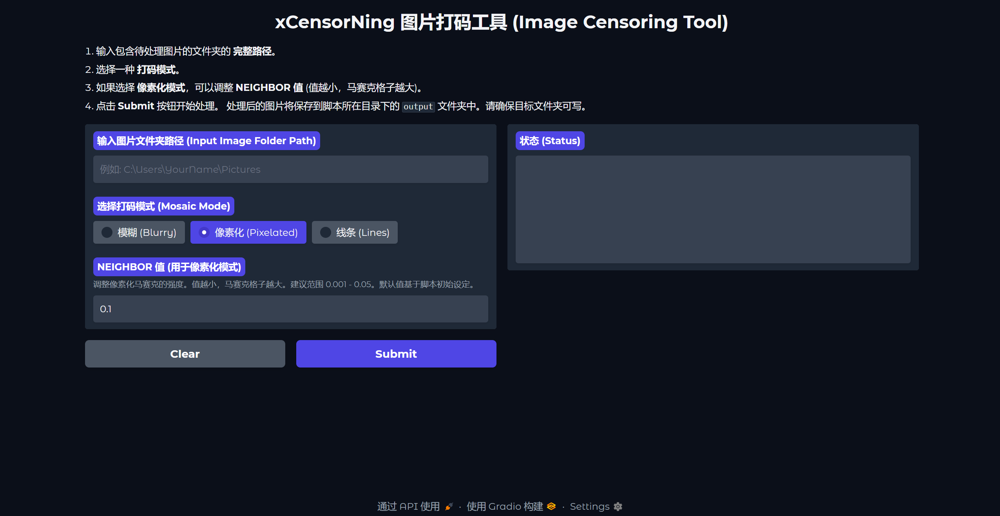

# xCensorNing (Image Censoring Tool)

xCensorNing is a simple image censoring tool that allows you to blur specific parts of an image.



## Installation

To install xCensorNing, simply clone this repository:

```sh
git clone <this-repo>
```

Install the required dependencies using pip:

```sh
pip install -r requirements.txt
```

## Usage

To use xCensorNing, simply run the `xCensorNing.py` script and follow the prompts.

```sh
python xCensorNing.py
```

Open `http://127.0.0.1:2333`, then have fun!

The image will be saved as `./output` in the same directory as the script.

## Thanks

The main YOLO model and Implement used in this project is from https://github.com/zhulinyv/Semi-Auto-NovelAI-to-Pixiv.git

## License

APGL-3.0 (same as https://github.com/zhulinyv/Semi-Auto-NovelAI-to-Pixiv.git)
